# 云服务商为什么要建自己的数据中心?一个真实的故事

你知道吗,当云服务商决定建自己的数据中心时,就像一个租房多年的人终于决定买房——听起来很美好,但实际操作起来简直是一场冒险。

Cloud4Y做了15年云服务,一直租别人的机房。现在终于要建自己的了。为什么?因为长大了,需要更多空间。但建数据中心可不是搭个棚子那么简单,这玩意儿比你想象的复杂多了。

---

## 自己建还是继续租?这是个问题

拥有自己的数据中心意味着什么?简单说就是——一切都归你管。从电源、制冷到安全,全都是你说了算。听起来很爽对吧?

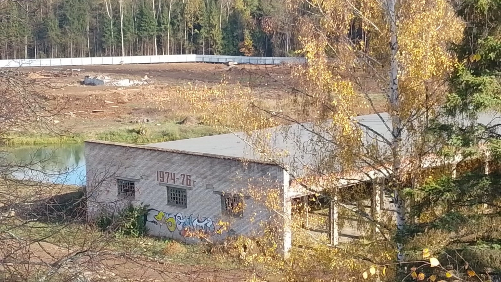

确实有好处。你不用看别人脸色,想怎么折腾就怎么折腾。客户也更信任你——毕竟所有问题你都能自己搞定。而且还能赚点外快,把多余的机架租给别人。

但问题来了:建数据中心就是另一门生意。你得懂工程、懂制冷、懂消防,还得养一大堆专业人员。更要命的是,得砸很多很多钱。建楼、装设备、搞认证,哪样都不便宜。建完之后还得不停地维护升级。

所以大多数云服务商宁愿租机房——省钱省心,专心做自己擅长的云服务就行了。但Cloud4Y觉得自己"够格"了,是时候拥有自己的地盘了。

## 在莫斯科郊外找了块地

他们选的地方叫马尔菲诺,离莫斯科市区22公里。这块地有8.2公顷,以前有人用过,但荒废几十年了。

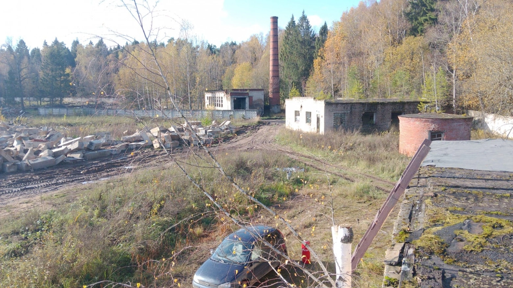

地方是挺安静的,但到处都是老旧建筑和垃圾。得先清理干净才能开工。好在交通方便,这点很重要——以后客户要来装设备,总不能让人扛着服务器翻山越岭吧。

有意思的是,他们在地里发现了一个小池塘。本来想填了算了,但池塘底下有泉眼,水一直在冒。👉 [想看看顶级云服务商如何从零开始建数据中心?点这里了解更多](https://cp.gthost.com/en/join/72c7e6b2fc118929f9ede2978f008806)

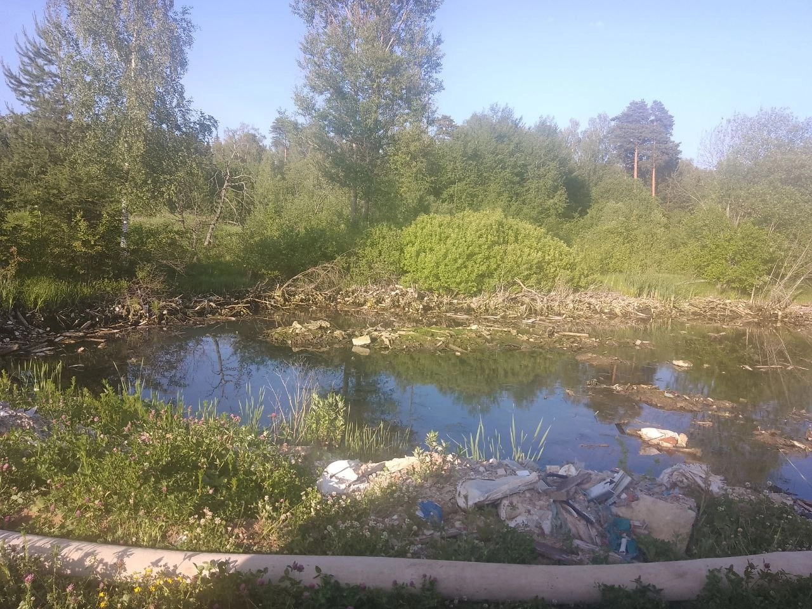

最后他们决定保留池塘,还打算往里面放鱼。为这个池塘,整个项目设计都得调整。但他们觉得值得——谁说数据中心周围就不能有点生活气息呢?

## 要建多大?分四步走

这个项目不是一口气建完的,分成四个阶段:

- 第一阶段:1200个机架,10兆瓦电力,5500平方米
- 第二阶段:2400个机架,20兆瓦,11000平方米  
- 第三阶段:3600个机架,30兆瓦,16500平方米
- 第四阶段:4800个机架,40兆瓦,22000平方米

所有系统都有备份,从N+1到2N级别。目标是拿到TIER III和TIER IV认证——这是数据中心界的"米其林星级"。

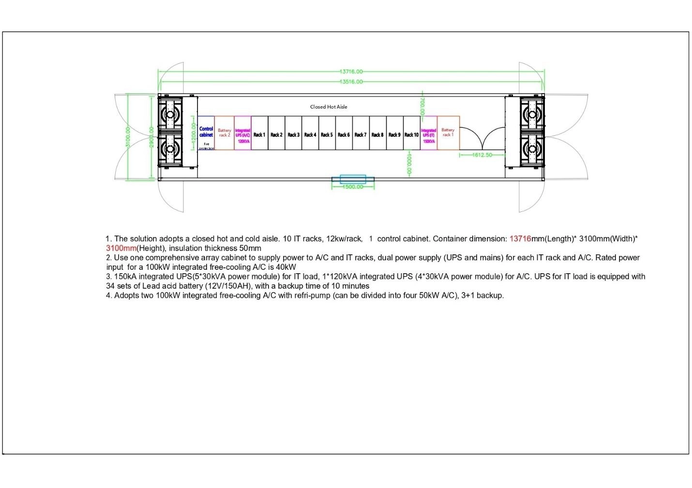

## 拆房子也是个技术活

清理场地时发现,那些看起来不大的老房子,地下都有巨大的地基和地下室。就像拔牙——你以为就露在外面那点,实际上根扎得老深了。

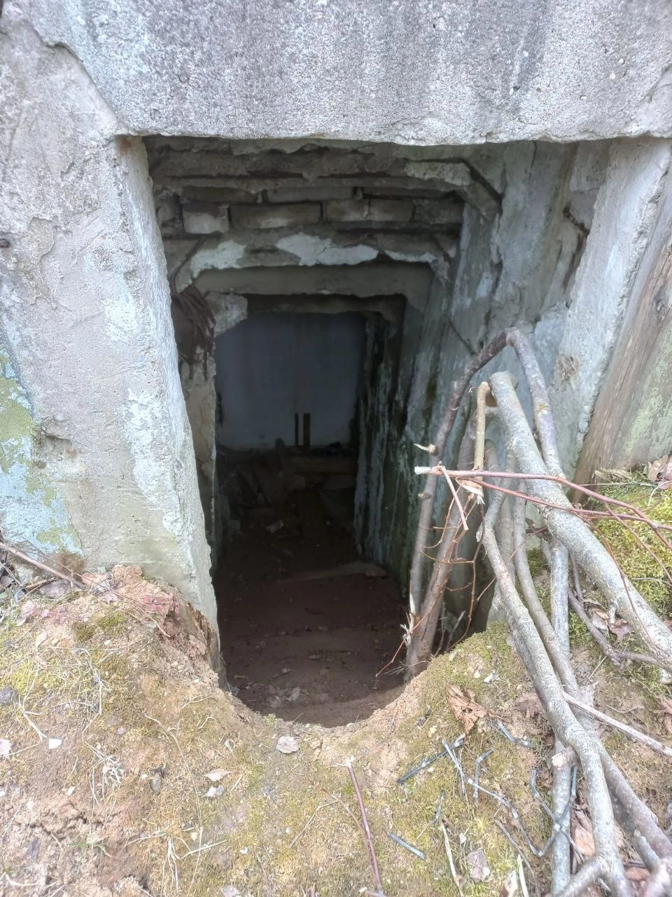

为什么要把这些建筑全拆了?两个原因:一是房子状况太差了,有的都快塌了;二是完全不符合现代数据中心的标准。

拆下来的砖头混凝土没扔,全用粉碎机打碎了,变成碎石子。

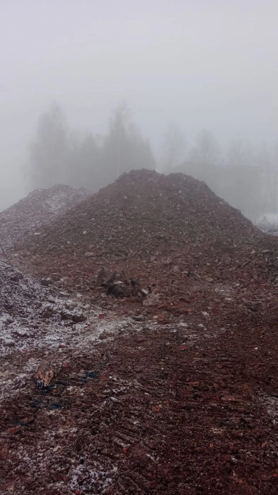

这么做有几个好处:省钱(不用买新材料)、环保(减少垃圾)、实用(用来填地基)。把建筑垃圾就地处理,还能加快施工速度,不用来回运输。

## 集装箱数据中心:先住"临时房"

等大楼建好还得等一阵子,但业务不能等啊。所以他们搞了个聪明的方案——集装箱数据中心(КЦОД)。

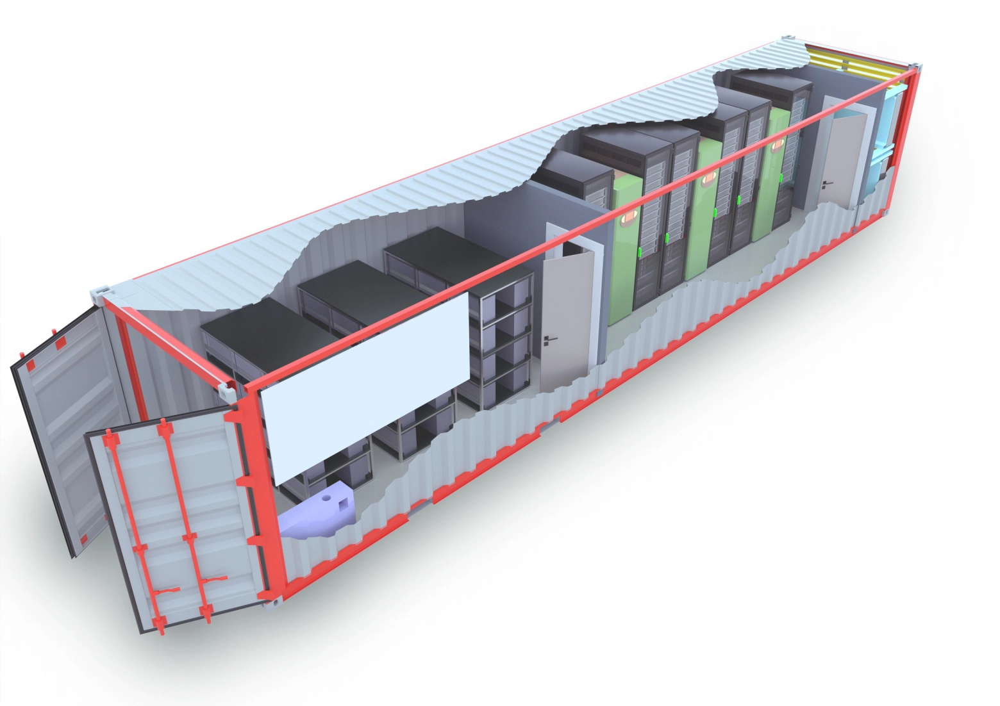

什么是集装箱数据中心?就是把服务器机房塞进一个加强版集装箱里,该有的设备一样不少:机架、制冷系统、UPS电源、安防监控,全都配齐。而且可以用卡车直接运到任何有电有网的地方。

这玩意儿特别适合:
- 偏远地区(盖楼太贵或没法盖)
- 临时项目(办个大型活动什么的)
- 应急备用(顶峰时期救急)
- 极端环境(西伯利亚那种鬼地方)
- 快速部署(等不及盖楼的时候)

在俄罗斯,石油天然气公司特别爱用这个,因为他们的油田都在西伯利亚和北极圈附近,那种地方盖传统数据中心又贵又难。

## Cloud4Y的集装箱有啥特别?

他们花了很长时间才找到合适的制造商——既能按他们的要求定制,又愿意后续不断改进。最后定制的这款集装箱,10个服务器机架,每个最高12千瓦,带独立冷热通道。

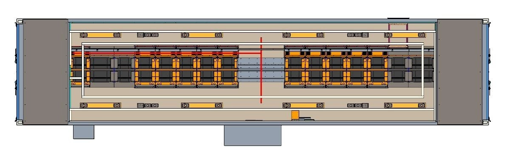

重点关注了这几方面:
- **制冷**:用了间接自然冷却技术,在温度适中时不用从外面吸风,直接通过热交换器循环降温,超省电
- **保暖**:加了厚厚的保温层,能扛住莫斯科的寒冬
- **安全**:温度、湿度、烟雾、门禁,该监控的都监控
- **实用**:所有设备都方便够到,线缆走线都提前规划好了

这个集装箱能在零下35度到零上45度之间正常工作。而且它符合TIER III标准,有完整的冗余备份系统。

## 进展到哪了?

**马尔菲诺(主战场):**
- 第一个集装箱已经运到了,先坐船到里加,再用卡车拉过来
- 打好了地基,装好了燃气发电站
- 正在接150千瓦的电(只够第一个集装箱用)
- 光纤网络7月能通
- 建了个临时棚子放备用发电机

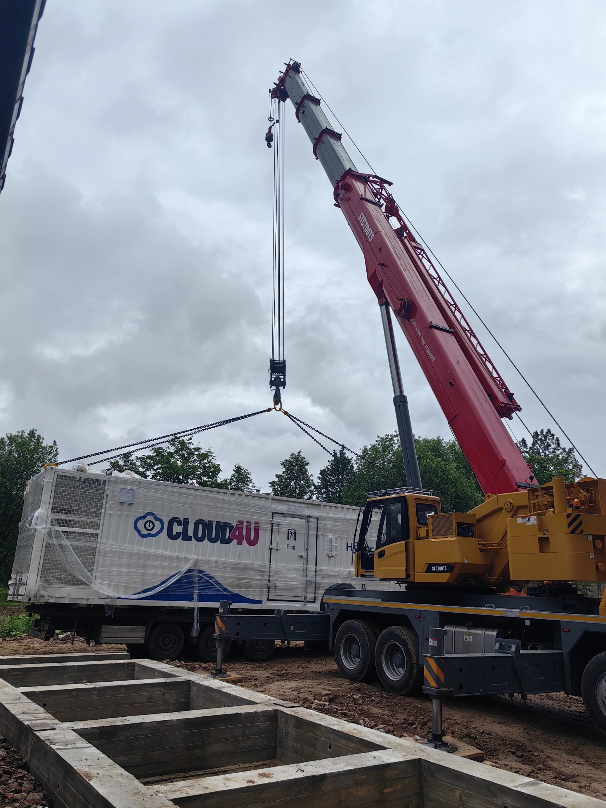

**梅季希(第二战场):**
- 买了一块2公顷的地,准备建第二个数据中心
- 申请了40兆瓦的电力接入
- 老建筑勘察完了:办公楼还行,机房那栋得大修或者推倒重建
- 地清干净了,准备开工

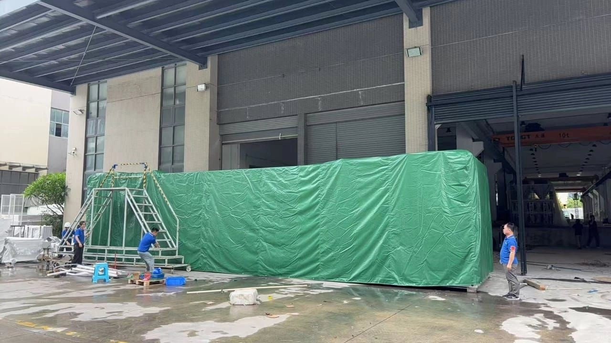

## 为什么150千瓦够用?

你可能会问:一个数据中心集装箱才150千瓦?够吗?

够!而且是绰绰有余。Cloud4Y的集装箱设计很特别——每个机架可以给到15千瓦,是普通数据中心(5-6千瓦)的2-3倍。这意味着你可以塞最耗电的高性能设备进去,跑AI训练、大数据分析什么的都不在话下。

150千瓦不只是给服务器用的,还得算上制冷系统、照明、监控、消防这些。Cloud4Y留了充足的余量,保证设备满载运行时电力依然稳定。

而且他们还准备了备用电源:UPS能撑10-30分钟,柴油发电机可以长时间供电。双保险。

## 接下来干啥?

**马尔菲诺的短期计划:**
- 把KPP(检查站)建好——这是安全第一道防线,不能马虎
- 继续扯皮电力问题,为第二、第三个集装箱争取更多电力配额
- 把排水系统搞定(要用泵站,因为距离太长了)
- 把金属遮阳棚装上

**梅季希的准备工作:**
- 搞定40兆瓦电力接入(这是个大工程)
- 决定旧楼是修还是拆
- 申请消防用水、自来水、污水处理、供暖的技术许可
- 规划好进场道路

## 他们还买了4500个IP地址

顺便说一句,Cloud4Y最近还买了一批4500个IPv4地址。现在IPv4地址紧缺,这批地址能让他们更灵活地给客户分配独立IP,不管是架网站还是搞复杂的系统集成都用得上。

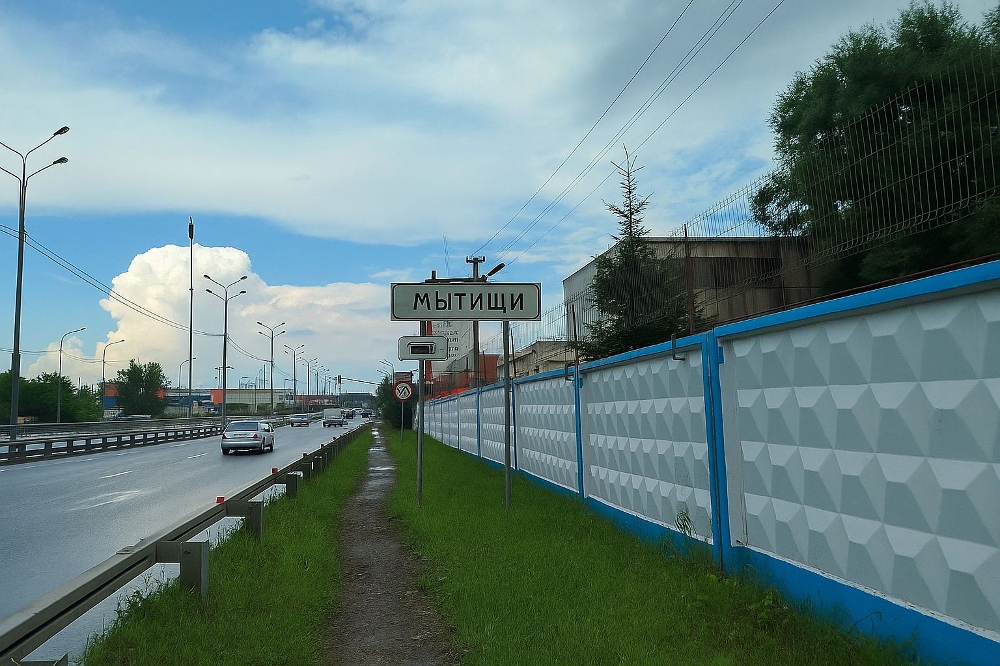

---

## 建数据中心到底图个啥?

说白了,Cloud4Y就是想给客户更稳定的服务。自己的地盘自己说了算,不用看别人脸色,出了问题也能第一时间解决。

而且有了自己的数据中心,他们能提供更多样化的服务,价格也能更有竞争力。集装箱数据中心这种灵活方案,既能快速上线,又能根据客户需求定制。

现在第一个集装箱2025年夏天就能投入使用,大楼预计明年建好。之后梅季希那边也会跟上。Cloud4Y的目标很明确:成为一个真正掌握核心资源的云服务商。

这故事告诉我们:有时候租房挺好的,但如果你打算长期发展,👉 [还是得有自己的"房子"——想了解专业数据中心服务如何助力业务增长?](https://cp.gthost.com/en/join/72c7e6b2fc118929f9ede2978f008806)
